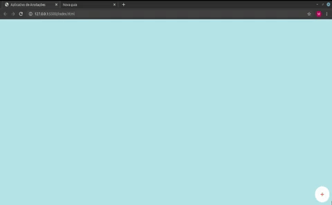
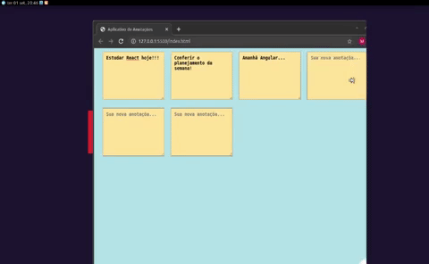

# Plataforma para criar lembretes e anotações.

---

---

## Feito com:
<ul>
  <li> HTML  </li> 
  <li> CSS </li> 
  <li> JavaScript 
  </li> 
  <li> jQuery  </li> 
</ul>

Modelo website responsivo  para mobile 📲.  
🤓 

